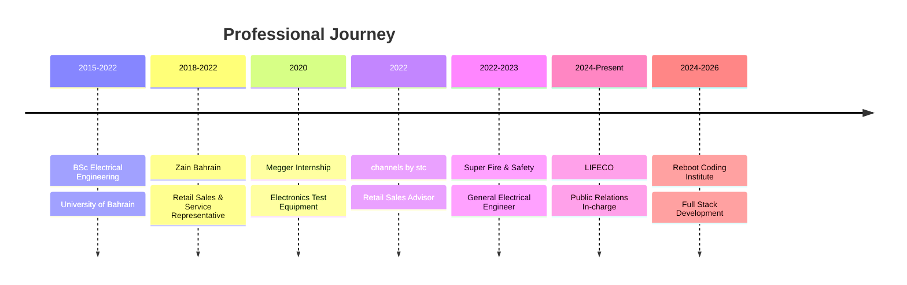

#  Hi, I'm Sayed Ahmed Husain

<div align="center">
  
</div>

<div align="center">
  
  <a href="https://github.com/sahmedhusain?tab=followers">
    
  </a>
  <a href="https://github.com/sahmedhusain">
    
  </a>
</div>


## 🚀 About Me


```
🔌 Electrical Engineer | BSc from University of Bahrain (2015-2022)
💼 Public Relations In-charge @ LIFECO - Fire & Safety Equipment
🎓 Currently pursuing Full Stack Development @ Reboot Coding Institute (2024-2026)
🔥 3+ Years in Fire Safety Systems Design & Implementation
📡 4+ Years in Telecommunications & Sales Leadership
🌱 Transitioning into Tech to build innovative solutions
🎯 Goal: Integrate engineering expertise with modern software development
📍 Based in Northern Governorate, Bahrain
```

### 🏢 Professional Journey

- **LIFECO** - Leading public relations strategies and sales operations
- **Super Fire & Safety Services** - Designed and implemented fire alarm systems following NFPA standards
- **channels by stc & Zain Bahrain** - Telecommunications sales and customer service excellence
- **Megger** - Electronics test equipment internship


## 🛠️ Technical Skills & Technologies

### 💻 Programming Languages & Web Development
<p align="center">
  
  
  
  
  
  
  
</p>

### 🌐 Frameworks & Libraries
<p align="center">
  
  
  
  
  
  
</p>

### 📊 Databases & Backend
<p align="center">
  
  
  
  
  
</p>

### 🔧 Tools & Technologies
<p align="center">
  
  
  
  
  
  
  
</p>

### ⚡ Engineering & Industry Expertise
<p align="center">
  
  
  
  
  
  
</p>


## 📊 GitHub Statistics

<div align="center">
  
  
</div>

<div align="center">
  
</div>

### 📈 Contribution Graph
<div align="center">
  
</div>


## 🏆 Certifications & Achievements

### 📜 Professional Certifications
- 🌞 **NOCN Level 3 Award** - Solar PV Installer and Operator
- 🧠 **Emotional Intelligence** Certification
- 💼 **Corporate Sales Fundamentals** Certification
- 🎓 **Professional Skills Certificate** - Information Technology (Reboot Coding Institute)

### 🌟 Key Achievements
- 📊 Successfully developed and executed sales strategies for LIFECO across Bahrain
- 🔥 Led fire safety system implementations for major clients including:
- 📈 Improved regional sales volumes through targeted marketing strategies
- 🤝 Established strong relationships with government ministries and authorities
- 👥 Managed and led technical teams for complex electrical installations


## 💼 Professional Experience Timeline




## 🎯 Current Focus & Learning Path

- 🚀 **Full Stack Development** - Building modern web applications with React, Node.js, and Next.js
- 🔗 **API Development** - Creating RESTful APIs and GraphQL services
- 📱 **Responsive Design** - Crafting seamless user experiences across all devices
- 🗄️ **Database Management** - Working with SQL and NoSQL databases
- 🔐 **Security Best Practices** - Implementing secure authentication and authorization
- ☁️ **Cloud Technologies** - Exploring AWS and cloud deployment strategies
- 🤖 **AI Integration** - Learning to integrate AI/ML solutions into applications


## 🌐 Languages

- 🇸🇦 **Arabic** - Native/Bilingual Proficiency
- 🇬🇧 **English** - Full Professional Proficiency


## 🤝 Connect With Me

<div align="center">
  <a href="https://www.linkedin.com/in/97ahm/" target="_blank">
    
  </a>
  <a href="mailto:sayedahmed97.sad@gmail.com">
    
  </a>
  <a href="https://twitter.com/_97ahm" target="_blank">
    
  </a>
  <a href="https://github.com/sahmedhusain" target="_blank">
    
  </a>
</div>

### 📫 Get in Touch
- 📧 **Email:** sayedahmed97.sad@gmail.com
- 📱 **Mobile:** +973 33115351
- 💼 **LinkedIn:** [/in/97ahm](https://www.linkedin.com/in/97ahm/)
- 🐦 **X (Twitter):** [@_97ahm](https://twitter.com/_97ahm)


## 💭 Quote of the Day

<div align="center">
  
</div>


## 🐍 Contribution Snake

<div align="center">
  <picture>
    <source media="(prefers-color-scheme: dark)" srcset="https://raw.githubusercontent.com/platane/platane/output/github-contribution-grid-snake-dark.svg">
    <source media="(prefers-color-scheme: light)" srcset="https://raw.githubusercontent.com/platane/platane/output/github-contribution-grid-snake.svg">
    
  </picture>
</div>


<div align="center">
  <b>Welcome to my GitHub profile! I'm on an exciting journey from Electrical Engineering to Full Stack Development.</b>
  <br>
  <b>Let's connect and build something amazing together! 🚀</b>
  
  <br><br>
  
  [](https://visitcount.itsvg.in)
  
  <br>
  
  **"Bridging the gap between Engineering Excellence and Software Innovation"** 
</div>

<div align="center">
  
</div>
