#  Hi, Welcome to my profile!

Full-Stack Developer | Go & JavaScript | Real-Time & Backend-Focused Systems

  

  

  

    
    
    
  

  

## 🚀 About Me

<table style="border-collapse: collapse; border: none;">
<tr>
<td style="border: none; vertical-align:top; text-align:left; padding-right:20px;">
    
I’m a full-stack developer with a strong engineering background, currently building modern web systems using Go, JavaScript, and contemporary frontend frameworks.

    
I began my career in electrical engineering and fire safety systems, working on real-world, safety-critical projects. That experience shaped how I approach software today: structured design, clear logic, and systems that are reliable under real constraints.

    
I’m currently focused on backend-heavy full-stack development, real-time applications, and building complete products end to end — from database design and APIs to user experience and deployment.

</td>
<td style="border: none; vertical-align:top; text-align:right;">
    
</td>
</tr>
</table>

## 📌 Quick Index

  
  
  
  
  
  

  

## 📊 GitHub Statistics

  

  
  

  
  

  

  

## ⭐ Featured Projects

### ⚡ Full-Stack Platforms

- **GigaBit** — Full-stack, real-time social network  
  Go backend, WebSockets, React/Next.js, SQLite, Docker  
  🔗 Repo: https://github.com/sahmedhusain/gigabit

- **01-ConnectHub** — Web forum platform (auth, posts, comments, reactions, moderation)  
  Go backend + SQLite with a clean server-side rendering flow  
  🔗 Repo: https://github.com/sahmedhusain/01-connecthub

- **ConnectHub RT** — Real-time forum and chat (live updates + messaging)  
  Go backend, WebSockets, real-time notifications/updates  
  🔗 Repo: https://github.com/sahmedhusain/connecthub-rt

### 🧩 Frameworks & Learning Builds

- **PicoJS Framework** — Zero-dependency reactive JavaScript framework  
  Virtual DOM, state management, routing built from scratch  
  🔗 Repo: https://github.com/sahmedhusain/picojs-framework  
  🌐 Demo: https://sahmedhusain.github.io/picojs-framework/

### 📊 Data & Dashboards

- **01 Dashboard** — Learning analytics dashboard  
  React + GraphQL, data visualization, frontend-focused project  
  🔗 Repo: https://github.com/sahmedhusain/01-dashboard

### 🧠 Systems, Networking & Algorithms (Go)

- **GoTalk** — TCP chat server (terminal clients, concurrent connections)  
  Goroutines/channels, message broadcast, logs, timestamps  
  🔗 Repo: https://github.com/sahmedhusain/gotalk

- **AntFinder** — Pathfinding simulation for ant colonies  
  Graph parsing + DFS path discovery + movement simulation  
  🔗 Repo: https://github.com/sahmedhusain/antfinder

<strong>➕ More public repos</strong>

- Explore everything here: https://github.com/sahmedhusain?tab=repositories

### 🚚 Tooling I Ship With

  
  
  
  
  
  
  
  
  
  
  
  

_Consistent local setup, clear run instructions, and practical tooling for building and debugging end-to-end._

  

## 🛠️ Technical Skills & Technologies

**Core Focus:**  
Backend-heavy full-stack development with **Go** (APIs, concurrency, WebSockets), **React/Next.js** frontends, **SQLite/PostgreSQL** data modeling, and production-style **Docker** workflows. Strong domain grounding from **Electrical / Fire Safety systems** work.

<strong>View full badges & tools (expand/collapse)</strong>

### Primary Stack (What I use most)

  
  
  
  
  
  
  
  
  
  
  
  
  

  
  
  

### Supporting Tools & Experience

  
  
  
  
  
  
  
  
  

### Exploring / Familiar With

  
  
  
  
  
  
  

### Engineering & Industry Background

  
  
  
  
  
  
  
  

  

## 🧭 Experience Summary

My background spans engineering, customer-facing technical roles, and software development. I’ve worked on safety-critical electrical systems, telecom sales and leadership roles, and now focus on building scalable, maintainable software systems with modern web technologies.

  

## 💼 Professional Experience Timeline

<strong>🗓️ View timeline (expand/collapse)</strong>

 

> **Quick legend:**  
> **Engineering** (Fire & Electrical) → **Telecom Sales/Leadership** → **Full‑Stack Development** → **PR & Market Development**

### 🌟 Career Highlights (Snapshot)

- ⚡ Built hands-on experience in **fire alarm systems** through design support, installation/programming, and testing & commissioning work in Bahrain.
- 📡 Strengthened customer-facing execution through **telecom retail sales** roles, handling service support and day-to-day branch operations.
- 🧪 Completed an **internship at Megger** focused on electrical test equipment and practical lab workflows.
- 🚀 Currently combining **full-stack development (Reboot Coding Institute)** with **market development & client relations** in my role at LIFECO.

```mermaid
%%{init: {
  "theme": "base",
  "themeVariables": {
    "darkMode": true,
    "background": "#0f172a",
    "primaryColor": "#3b82f6",
    "lineColor": "#334155",
    "textColor": "#f8fafc",
    "fontSize": "15px",
    "fontFamily": "Inter, system-ui, sans-serif",

    "taskBkgColor": "#6366f1",
    "taskTextColor": "#e2e8f0",
    "taskBorderColor": "#4338ca",

    "activeTaskBkgColor": "#10b981",
    "activeTaskTextColor": "#ffffff",
    "activeTaskBorderColor": "#059669",

    "doneTaskBkgColor": "#64748b",
    "doneTaskTextColor": "#f1f5f9",
    "doneTaskBorderColor": "#475569",

    "milestoneBkgColor": "#f59e0b",
    "milestoneBorderColor": "#b45309"
  },
  "gantt": {
    "barHeight": 28,
    "barGap": 8,
    "topAxis": true,
    "leftAxis": true,
    "gridLineStartPadding": 35
  }
}}%%
gantt
title 📍 Professional Timeline
dateFormat  YYYY-MM-DD
axisFormat  %Y

section 🎓 Education
University of Bahrain — Bachelor of Science in Electrical Engineering :done, edu1, 2015-09-01, 2022-06-30
Reboot Coding Institute — Full-Stack Development Program :active, edu2, 2024-04-01, 2026-06-30

section 🧪 Internships
Megger — Electrical Test Equipment Internship :done, int1, 2020-07-01, 2020-09-30

section 💼 Career
Zain Bahrain — Retail Sales Representative :done, job1, 2019-02-01, 2022-03-31
channels by stc — Retail Sales Advisor :done, job2, 2022-04-01, 2022-09-30
Super Fire & Safety — General Electrical Engineer :done, job3, 2022-10-01, 2023-10-31
LIFECO — Public Relations In-Charge :active, job4, 2024-05-01, 2026-02-01

section 🏆 Licenses & Certifications
Corporate Sales Fundamentals — Golden Trust :milestone, cert1, 2019-11-01, 0d
Emotional Intelligence — Golden Trust :milestone, cert2, 2019-08-01, 0d
Basic Life Support (BLS) — American Heart Association :milestone, cert3, 2022-07-01, 0d
Engineering License (Electrical) — CRPEP :milestone, cert4, 2022-12-01, 0d
Electrical Installation Wireman — EWA Bahrain :milestone, cert5, 2024-02-01, 0d
NOCN Level 3 Award — Solar PV Installer and Operator (NOCN Group) :milestone, cert6, 2024-03-01, 0d
NOCN Level 3 Award — Solar PV Installer and Operator (EWA Acknowledgment) :milestone, cert7, 2024-07-01, 0d
```

  

## 🎯 Current Focus & Learning Path

<strong>🯠View current focus (expand/collapse)</strong>

- 🚀 **Full Stack Development** - Building modern web applications with React, Node.js, and Next.js
- 🔗 **API Development** - Creating RESTful APIs and GraphQL services
- 📱 **Responsive Design** - Crafting seamless user experiences across all devices
- 🗄️ **Database Management** - Working with SQL and NoSQL databases
- 🔐 **Security Best Practices** - Implementing secure authentication and authorization
- ☁️ **Cloud Technologies** - Exploring AWS and cloud deployment strategies
- 🤖 **AI Integration** - Learning to integrate AI/ML solutions into applications

  

## 🌐 Languages

<strong>🌠View languages (expand/collapse)</strong>

  
  

- 🇸🇦 **Arabic** - Native/Bilingual Proficiency
- 🇬🇧 **English** - Full Professional Proficiency

  

## 🤝 Connect With Me

<strong>🤠View contact links (expand/collapse)</strong>

  
  
  
  
  

### 📫 Get in Touch

- 📧 **Email:** sayedahmed97.sad@gmail.com
- 💬 **Discord:** [s_97ahm](https://discord.com/users/s_97ahm)
- 💼 **LinkedIn:** [Sayed Ahmed Husain](https://www.linkedin.com/in/97ahm/)
- 🐦 **X (Twitter):** [@\_97ahm](https://twitter.com/_97ahm)

  

## 🤝 Open to Collaboration & Opportunities

I enjoy working on projects that involve real systems, clear problem spaces, and thoughtful design.  
I’m especially interested in backend-heavy or full-stack roles where reliability, data flow, and real-time behavior matter.

If you’d like to collaborate, discuss a project, or exchange ideas, feel free to reach out.

  

## 💭 Quote of the Day

  

  

## 🐍 Contribution Snake

  <picture>
    <source media="(prefers-color-scheme: dark)" srcset="https://raw.githubusercontent.com/platane/platane/output/github-contribution-grid-snake-dark.svg">
    <source media="(prefers-color-scheme: light)" srcset="https://raw.githubusercontent.com/platane/platane/output/github-contribution-grid-snake.svg">
    
  </picture>

  

  <b>Welcome to my GitHub profile — I’m building a focused path from engineering fundamentals to full-stack software development.</b>
   
  <b>If you’re working on something meaningful, I’d love to connect. 🚀</b>
  
    
  
  
  
   
  
  **"Bridging the gap between Engineering Excellence and Software Innovation"** 

  

